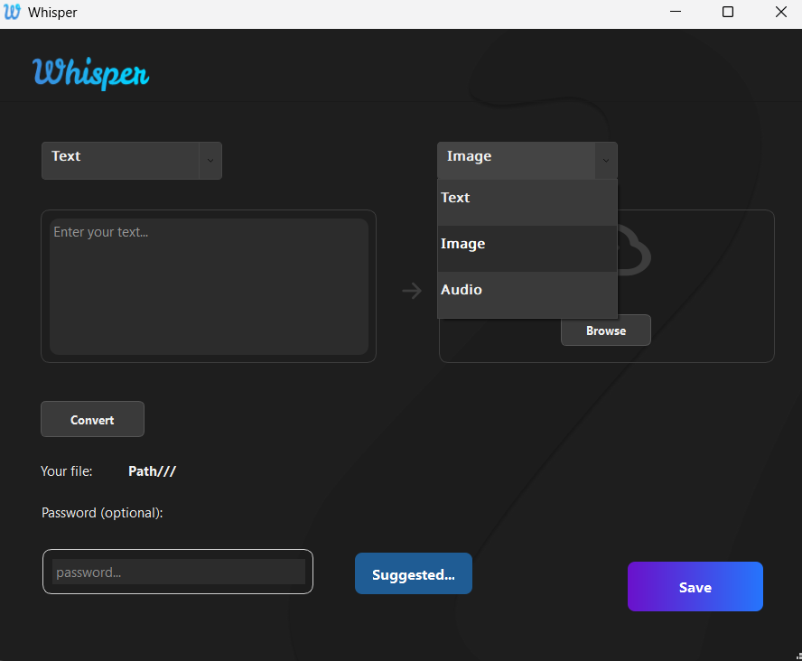
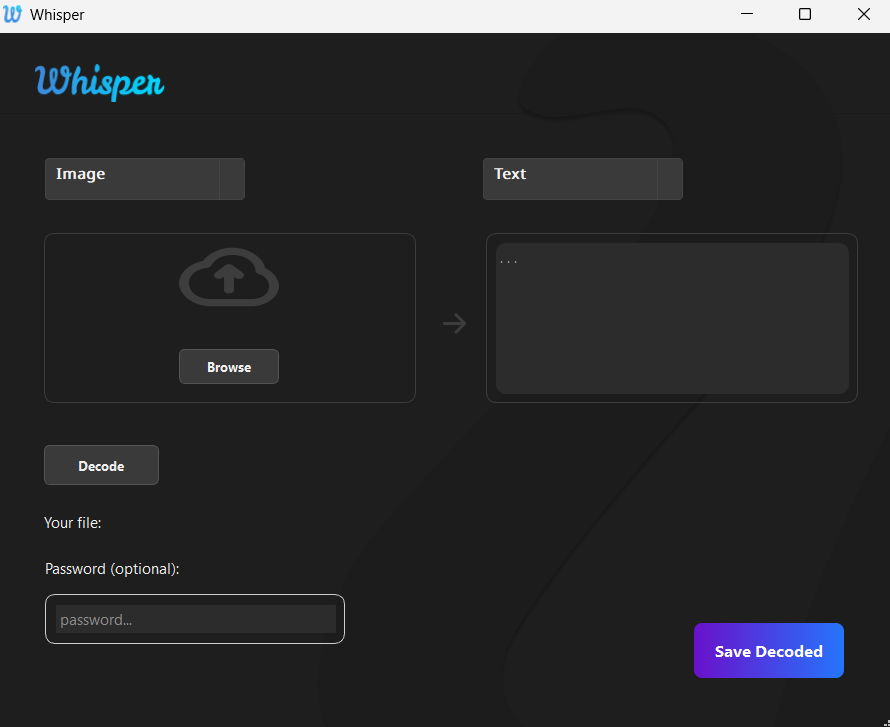

# Whisper

Whisper is a powerful speech-to-text transcription project using OpenAI's Whisper model. It allows for audio input to be transcribed into accurate, readable text across multiple languages.

---

## 🚀 Features

- 🎙️ Hide Text and Image files (PNG)
- Text -> Text
- Text -> Image
- Text -> Audio
- Image -> Image
- 🧠 Extract hidden content
- from Text -> Text
- from Image -> Text
- from Audio -> Text
- from Image -> Image
- 🖥️ User-friendly interface
- 📝 Save data and set password

---

## 📁 Project Structure

```bash
gui/
├── HideMessage
  ├── hideMessage.py
├── RevealMessage
  ├── revealContent.py
├── StartWindow
  ├── mainWindow.py
Whisper/
├── AESCipher.py
├── AudioTextSteganography.py
├── Cryptography.py
├── ImageSteganography.py
├── main.py
├── protection.py
├── Reverse_Crypt.py
├── steganography.py
├── StegoTextPass.py


---
## 🖥️ How to run the application

🖥 (Git Bash):
/d/whisper project $ python -m gui.StartWindow.mainWindow

---

## Main Window


## Hide Content


## Reveal Content



---
📦 Installation
Clone the repository:
[git clone https://github.com/Mari-Tchokhuri/Sakontrolo1.git](https://github.com/Mari-Tchokhuri/Whisper.git)


